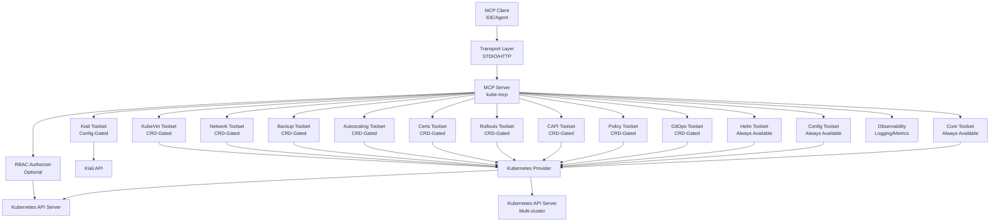
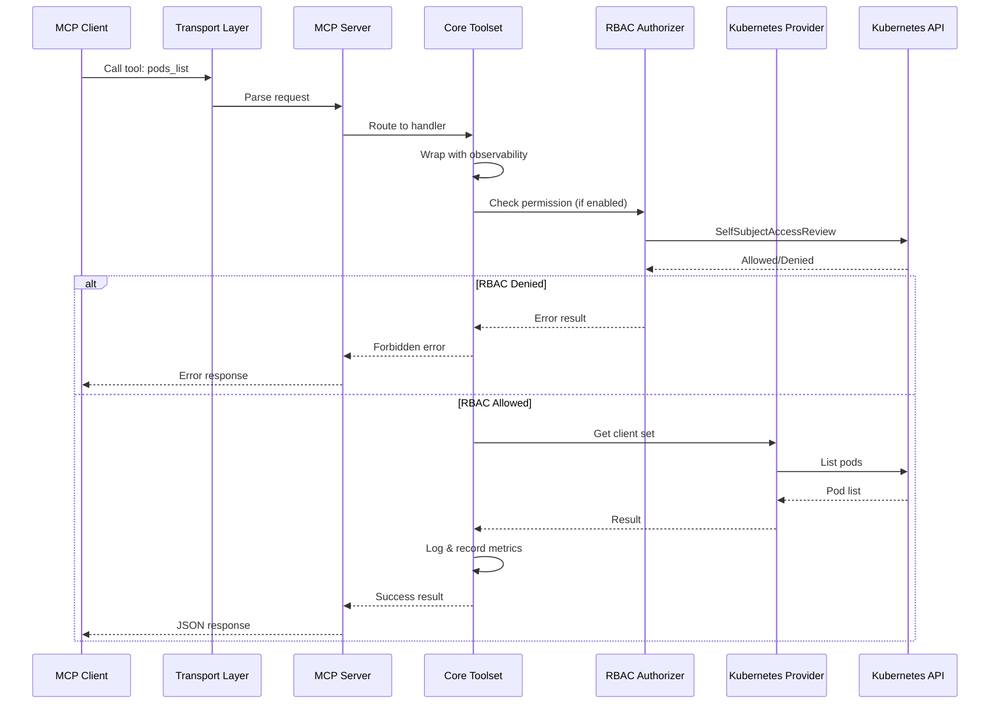
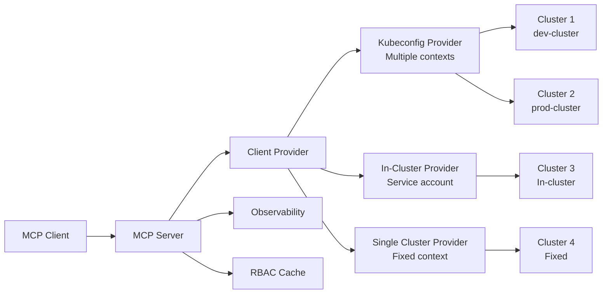

# Architecture

## Overview

kube-mcp is a native Go Model Context Protocol (MCP) server that provides comprehensive Kubernetes management capabilities. It follows a modular architecture with clear separation of concerns.

## System Architecture

```
┌─────────────────────────────────────────────────────────────┐
│                      MCP Server Core                        │
│  ┌──────────────┐  ┌──────────────┐                         │
│  │   STDIO      │  │     HTTP     │                         │
│  │  Transport   │  │  Transport   │                         │
│  │              │  │(Streamable)  │                         │
│  └──────────────┘  └──────────────┘                         │
└─────────────────────────────────────────────────────────────┘
                            │
                            ▼
┌─────────────────────────────────────────────────────────────┐
│                    Toolset Registry                         │
│  ┌──────┐  ┌──────┐  ┌──────┐  ┌──────┐  ┌──────┐           │
│  │Config│  │ Core │  │ Helm │  │GitOps│  │Policy│           │
│  └──────┘  └──────┘  └──────┘  └──────┘  └──────┘           │
│  ┌──────┐  ┌──────┐  ┌──────┐  ┌──────┐  ┌──────┐           │
│  │ CAPI │  │Roll  │  │Certs │  │Auto  │  │Backup│           │
│  │      │  │outs  │  │      │  │scale │  │      │           │
│  └──────┘  └──────┘  └──────┘  └──────┘  └──────┘           │
│  ┌──────┐  ┌──────┐  ┌──────┐                               │
│  │ Net  │  │Kube  │  │Kiali │                               │
│  │      │  │ Virt │  │      │                               │
│  └──────┘  └──────┘  └──────┘                               │
└─────────────────────────────────────────────────────────────┘
                            │
                            ▼
┌─────────────────────────────────────────────────────────────┐
│              Kubernetes Client Provider                     │
│  ┌──────────────┐  ┌──────────────┐  ┌──────────────┐       │
│  │  Kubeconfig  │  │ In-Cluster   │  │   Single     │       │
│  │   Provider   │  │   Provider   │  │  Provider    │       │
│  └──────────────┘  └──────────────┘  └──────────────┘       │
│                                                             │
│  ┌──────────────┐  ┌──────────────┐  ┌──────────────┐       │
│  │    Typed     │  │   Dynamic    │  │  Discovery   │       │
│  │    Client    │  │    Client    │  │   Client     │       │
│  └──────────────┘  └──────────────┘  └──────────────┘       │
└─────────────────────────────────────────────────────────────┘
```

## Package Structure

### `pkg/mcp/`
MCP protocol implementation and toolset management:
- `server.go` - MCP server wrapper with tool name normalization support
- `types.go` - Toolset interface and registry
- `tools.go` - Tool building helpers
- `stdio.go` - STDIO transport
- `addtool.go` - Tool registration wrapper for name normalization (n8n compatibility)
- `transport.go` - Transport interface definitions

### `pkg/kubernetes/`
Kubernetes client management:
- `provider.go` - Client provider implementations (kubeconfig, in-cluster, single)
- `factory.go` - Client factory for creating typed and dynamic clients
- `rbac.go` - RBAC checking with caching support
- `discovery.go` - CRD discovery and GVR caching
- `rbac_cache.go` - RBAC cache implementation with TTL
- `targeting.go` - Multi-cluster context targeting utilities
- `auth.go` - Kubernetes authentication helpers
- `types.go` - Kubernetes client type definitions

### `pkg/toolsets/`
Modular toolset implementations (13 toolsets total, 60+ tools):

**Always Available:**
- `config/` - Kubeconfig inspection and context management
- `core/` - Core Kubernetes operations (pods, resources, namespaces, nodes, events, metrics, scaling)
- `helm/` - Helm chart and release management

**CRD-Gated (Auto-enabled when CRDs detected):**
- `gitops/` - GitOps application management (Flux Kustomization/HelmRelease, Argo CD Application)
- `policy/` - Policy engine visibility (Kyverno, Gatekeeper)
- `capi/` - Cluster API cluster lifecycle management
- `rollouts/` - Progressive delivery management (Argo Rollouts, Flagger Canary)
- `certs/` - Cert-Manager certificate lifecycle management
- `autoscaling/` - HPA (always available) and KEDA autoscaling management
- `backup/` - Velero backup and restore management
- `net/` - NetworkPolicy (always available), Cilium policies, and Hubble flows
- `kubevirt/` - KubeVirt VM lifecycle management

**Configuration-Gated:**
- `kiali/` - Service mesh observability via Kiali API

### `pkg/config/`
Configuration management:
- `loader.go` - TOML loader with drop-in support
- `merge.go` - Deep merge algorithm
- `reload.go` - Hot reload on SIGHUP
- `reload_semantics.go` - Runtime-reloadable vs restart-required settings
- `types.go` - Configuration type definitions for all toolsets
- `defaults.go` - Default value application

### `pkg/http/`
HTTP transport (Streamable HTTP):
- `server.go` - HTTP server with OAuth (uses `mcp.NewStreamableHTTPHandler`)
- `oauth.go` - OAuth middleware with TokenReview integration
- `kubernetes_token.go` - Kubernetes token extraction and validation

## Architecture Diagrams

### High-Level Architecture



### Request Flow for Core Tool (e.g., pods_list)



### Multi-Cluster Architecture



### Observability Flow

```mermaid
flowchart TB
    Request[Tool Request] --> Wrapper[Observability Wrapper]
    Wrapper --> Handler[Tool Handler]
    Handler --> K8s[Kubernetes API]
    K8s --> Handler
    Handler --> Wrapper
    
    Wrapper --> Logger[Structured Logger<br/>slog]
    Wrapper --> Metrics[Prometheus Metrics]
    Wrapper --> Recovery[Panic Recovery]
    
    Logger --> LogOutput[Log Output<br/>JSON/Text]
    Metrics --> PromEndpoint[/metrics endpoint]
```

## Data Flow

1. **Request Reception**: MCP client sends request via transport (STDIO/HTTP)
2. **Tool Resolution**: MCP server resolves tool name to handler
3. **Observability Wrapper**: Request wrapped with logging, metrics, panic recovery
4. **RBAC Check**: If enabled, RBAC authorizer checks permissions before operation
5. **Toolset Dispatch**: Request routed to appropriate toolset
6. **Kubernetes Operation**: Toolset uses Kubernetes client provider
7. **Response**: Result formatted as MCP response and sent back
8. **Observability**: Logs and metrics recorded for the operation

## Security Model

- **RBAC**: All operations respect Kubernetes RBAC via SelfSubjectAccessReview
- **RBAC Caching**: Configurable TTL-based caching for performance (default 5 seconds)
- **Read-Only Mode**: Optional read-only mode prevents all write operations
- **Non-Destructive Mode**: Allows reads and applies, prevents deletes
- **Denied GVKs**: Configurable list of GroupVersionKinds that cannot be accessed
- **OAuth**: HTTP transport supports OAuth2/OIDC authentication
- **Token Validation**: Bearer token validation via Kubernetes TokenReview API
- **Mutation Safety**: All mutation tools require `confirm: true` flag
- **Distroless Container**: Minimal attack surface with non-root user

## Multi-Cluster Support

The system supports multiple Kubernetes clusters through:
- Kubeconfig provider: Manages multiple contexts
- In-cluster provider: Uses service account credentials
- Single-cluster provider: Fixed context mode

## Toolset Architecture

kube-mcp implements **13 toolsets** providing **60+ MCP tools**:

### Always Available Toolsets
- **Config**: Kubeconfig inspection (`config.contexts_list`, `config.current_context`)
- **Core**: Core Kubernetes operations (pods, resources, namespaces, nodes, events, metrics, scaling, patching, diffing, watching)
- **Helm**: Helm chart and release management (`helm.releases_list`, `helm.release_get`, `helm.release_install`, etc.)

### CRD-Gated Toolsets (Auto-enabled when CRDs detected)
- **GitOps**: Flux (Kustomization, HelmRelease) and Argo CD (Application) management
- **Policy**: Kyverno and Gatekeeper policy visibility and violation tracking
- **CAPI**: Cluster API cluster lifecycle, machine management, and rollout status
- **Rollouts**: Argo Rollouts and Flagger progressive delivery management
- **Certs**: Cert-Manager certificate lifecycle, issuer management, and ACME challenge tracking
- **Autoscaling**: HPA (always available) and KEDA autoscaling management
- **Backup**: Velero backup and restore operations
- **Network**: NetworkPolicy (always available), Cilium policies, and Hubble flow queries
- **KubeVirt**: Virtual machine lifecycle operations

### Configuration-Gated Toolsets
- **Kiali**: Service mesh observability via Kiali API (requires Kiali URL and authentication)

All toolsets follow a consistent pattern:
- CRD discovery for feature gating
- Observability wrapping (logging, metrics, panic recovery)
- RBAC integration (when enabled)
- Multi-cluster support via context parameter
- Pagination support for list operations
- Mutation safety (confirm flag, read-only mode checks)

## Extensibility

New toolsets can be added by:
1. Implementing the `Toolset` interface
2. Registering with the MCP server in `cmd/kube-mcp/main.go`
3. Tools are automatically exposed via all transports
4. See [Developing New Toolsets](developing-new-toolsets.md) for detailed guide

